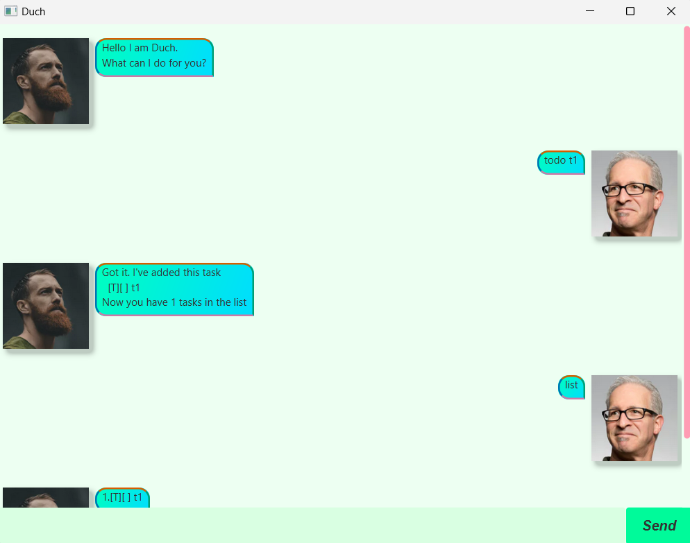

# Duch User Guide

### Duch, A ChatBot to manage your life

Having trouble with all the endless tasks in your life ? Duch will manage them for you.

## All commands
[deadline](#deadline) 
[todo](#todo) 
[event](#event) 
[list](#list) 
[mark](#mark-and-unmark) 
[unmark](#mark-and-unmark) 
[find](#find) 
[undo](#undo) 

## Important
[Exiting safely](#important-to-close-duch)

## Format of dates
All dates need to be in the format `DD/MM/YYYY hhmm`

## Deadline

You can add a deadline task. It is a special task that has a date, which is its deadline. The format of the date has to be in `DD/MM/YYYY hhmm`. Example: `12/02/2002 1800`.

Too add a deadline task, enter `deadline <description> /by <date>`

Example: `deadline hw /by 12/01/2002 1800`

If successful, Duch will acknowledge the creating of a new Deadline task

## Todo

A todo task is simply a description of a task. There are no dates whatsover

To add a todo task, enter `todo <description>`,

Example: `todo cook dinner`

If successful, Duch will acknowledge the creation of a new Todo task

## Event

An event task is an event with a from and to date

To add a event task, enter `event <description> /from <date> /to <date>`

Example: `event rag day /from 12/01/2002 1200 /to 12/02/2002 1200`

If successful, Duch will acknowledge the creation of a new Event task

## List

By typing in `list`, Duch will display all your tasks for you

## Mark and Unmark

Duch can help you mark and unmark events. First, get the index of the task using list, then type `mark <index of task>`. To unmark, simply type `unmark <index of task>`

Example: `mark 3` `unmark 4`

If mark is successful, Duch will acknowledge it

## Find

Duch can help you find tasks that contain a keywork. Simply type `find <keyword>` and Duch will list all tasks containing that keyword

Example: `find cs2103t`

If successful, Duch will acknowledge it, and list all tasks containing that keyword.

## Delete

Duch can help you delete tasks. Simply type `delete <index of task you want to delete>`

Example: `delete 2`

## Undo

Duch can undo the last executed command, if you change your mind. Simply type `undo` and that is it. 

If the last executed command is one of `todo, deadline, even, mark, unmark, delete`, Duch will display the updated list of tasks. 

If the last executed task is one of `list, find`, Duch will only acknowledge the success of the command, but since there is no change to the tasks, Duch will not display the updated list of tasks.

## Important: To close Duch

To close Duch, type `bye`. Do not click `X` to close the window, otherwise Duch will not save your tasks 